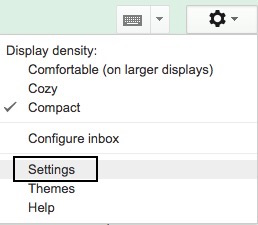
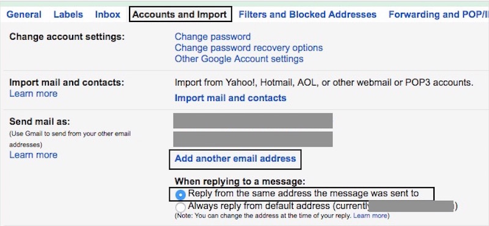
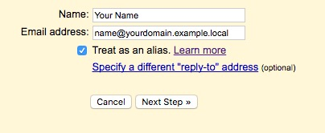
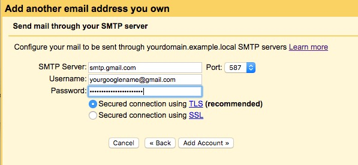

# Gmail with your own domain

## Go to Gmail Settings

## Accounts and Import

Choose *Add another email address*.

## Add Your Name and Email-address

This is the address you want to use in your email, e.g. tauno@scanabc.com.

## Configure Outgoing Mail Server

You can use Google's mail server:

* About Username: this will be *your Google username*
* About Password: *your password*, or
  * with two-factor authentication, generate new application password at
    <https://security.google.com/settings/security/apppasswords>
